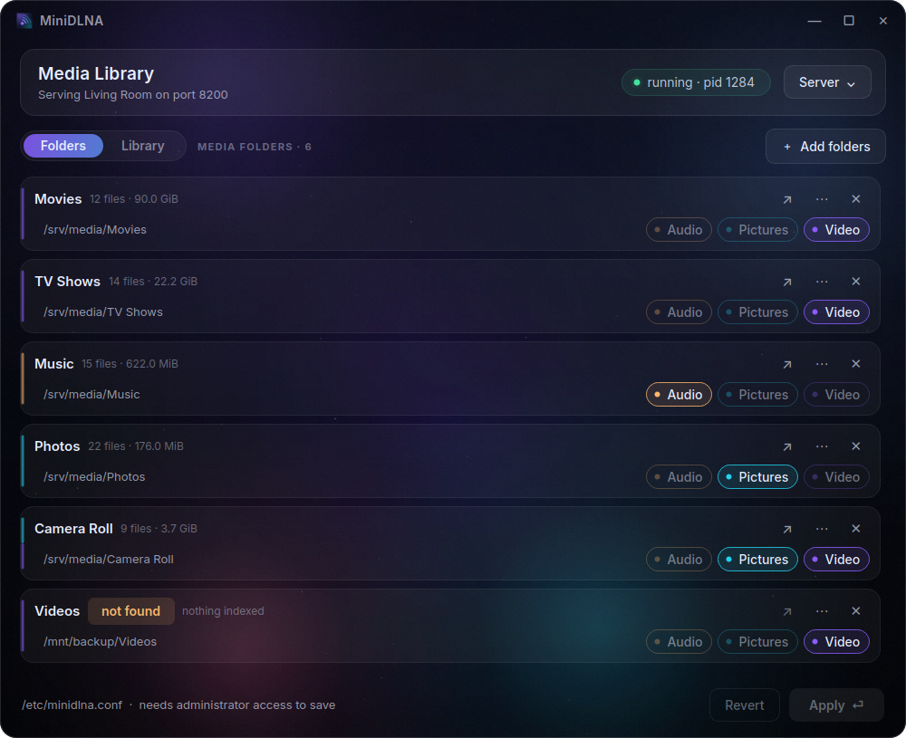
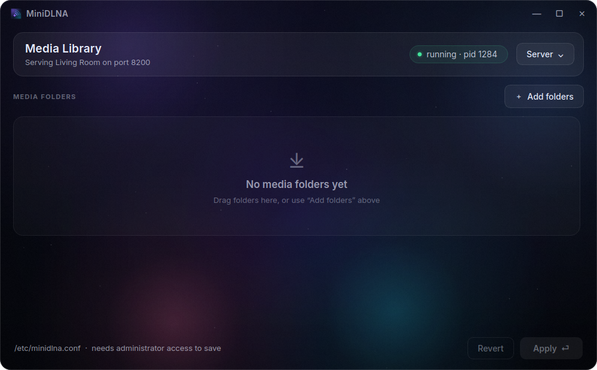
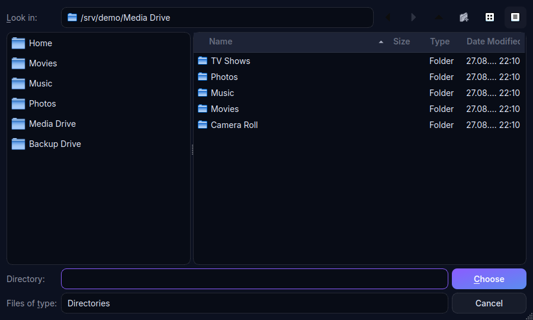

# MiniDLNA Configuration

[](https://github.com/Rec0iL/minidlna-config/actions/workflows/tests.yml)
[](LICENSE)

A desktop app for choosing which folders minidlna shares on your network.

Editing `minidlna.conf` by hand means remembering that `media_dir=PV,/path`
means "pictures and video", restarting the right service afterwards, and
working out for yourself why a folder you added shows up empty on your TV.
This does those parts for you.



## What it does

- **Add folders by dragging them in**, or several at once from the picker,
  which lists your media folders and every mounted drive in its sidebar.
- **Guesses the media type** from what is actually in a folder when you add
  it, and keeps it editable — the Audio / Pictures / Video chips combine, so a
  camera folder can hold both pictures and video.
- **Warns you when a folder will not work.** A folder that does not exist, or
  that the account minidlna runs as cannot read, is flagged in the list
  instead of silently serving nothing.
- **Applies in one step.** Saving and restarting minidlna happen together,
  behind a single authorisation prompt.
- **Leaves the rest of your config alone.** Only `media_dir=` lines are
  rewritten; comments, ordering and every other setting stay exactly as they
  were.

## Installing

```bash
git clone https://github.com/Rec0iL/minidlna-config.git
cd minidlna-config
./install.sh
```

Installs for the current user into `~/.local` — no root needed — and adds a
menu entry with an icon. Then run it from your application menu, or as
`minidlna-config`.

| Option | Effect |
| --- | --- |
| *(none)* | Install for you, into `~/.local` |
| `--system` | Install for all users into `/usr/local` (needs root) |
| `--prefix DIR` | Install into a specific prefix |
| `--link` | Point the launcher at the source directory instead of copying, so edits take effect immediately |
| `--venv` | Set up a private virtual environment with PySide6 if it is missing |
| `--uninstall` | Remove it again |

Uninstalling never touches your `minidlna.conf` or its backups.

### Requirements

Python 3 and PySide6. Install PySide6 from your package manager —
`python3-pyside6` on Fedora, `python3-pyside6.qtwidgets` on Debian and Ubuntu,
`pyside6` on Arch — or let `./install.sh --venv` set up a virtual environment.

You can also run it straight from the source directory without installing:

```bash
./start.sh
```

## Using it

Drop folders onto the window, or press **Ctrl+O**. Each folder's media types
are detected from its contents; change them with the chips on the row. Paths
are editable in place, and removing a folder offers an undo.



**Apply** (**Ctrl+S**) saves and restarts minidlna. Right-click it for *save
without restarting*, or *save and rebuild the media library*, which clears the
media database and rescans from scratch — useful when files have changed but
minidlna has not noticed.

The **Server** menu starts, stops and restarts the service, and opens its web
interface.



### Why a folder shows up empty

minidlna runs as its own user account, not as you. If that account cannot read
a directory — a common case, since home directories are often not world
readable — minidlna indexes nothing and your clients see an empty folder with
no error anywhere. The app checks this for every folder and flags it as
**unreadable**.

A folder flagged **not found** does not exist at all right now, which usually
means a removable or network drive is not mounted.

## How your configuration is treated

Only `media_dir=` lines are ever rewritten, in the place the old ones were, so
the comments around them still make sense. Loading and re-saving without
making a change reproduces the file byte for byte.

Writes are atomic: the new file is written alongside the old one and swapped
into place, so an interrupted save cannot leave you with a truncated config.
The previous version is kept as `minidlna.conf.bak-<timestamp>`, and the ten
most recent backups are retained.

## Privileges

`/etc/minidlna.conf` is owned by root, so saving needs authorisation. The app
runs as **you** and asks polkit (`pkexec`) only at the moment it writes the
file or controls the service.

The password is entered in your desktop's own polkit dialog; this application
never sees or handles it. Running the whole GUI as root is refused — a
graphical toolkit does not need root privileges so that you can pick a folder.
The privileged work is confined to `minidlnaconfig/helper.py`, which does
nothing but write the staged file and run `systemctl`.

## Development

```bash
python3 -m unittest discover -s tests
```

The parsing and file-writing logic has no Qt imports, so the tests need no
dependencies and no display server.

| Path | Purpose |
| --- | --- |
| `minidlnaconfig/models.py` | Media types and folder entries |
| `minidlnaconfig/config.py` | Parsing and atomic rewriting of minidlna.conf |
| `minidlnaconfig/service.py` | Service status, media-type guessing, permission and mount checks |
| `minidlnaconfig/privilege.py` | pkexec wrapper |
| `minidlnaconfig/helper.py` | The only code that runs as root |
| `minidlnaconfig/background.py` | Animated backdrop |
| `minidlnaconfig/widgets.py` | Glass panels, chips, folder rows, toasts |
| `minidlnaconfig/window.py` | Main window |
| `assets/` | Logo, rendered icon sizes, desktop-entry template |

To change the logo, edit `assets/minidlna-config.svg` and regenerate the
raster sizes with `python3 assets/render-icons.py`.

| Variable | Effect |
| --- | --- |
| `MINIDLNA_CONF` | Config file to edit (also `--config PATH`) |
| `MINIDLNA_GUI_NO_ANIM=1` | Freeze the animated background |
| `MINIDLNA_GUI_NATIVE_FRAME=1` | Use your window manager's title bar |
| `MINIDLNA_GUI_PYTHON` | Interpreter `start.sh` should use |

### If the menu icon does not appear

Desktop environments cache icon lookups, and KDE caches failed ones too. The
installer drops `~/.cache/icon-cache.kcache`, re-runs `kbuildsycoca6`, writes
an `index.theme` if the user icon directory lacks one, and removes a stale
`icon-theme.cache` it cannot rebuild. If a running panel still shows the old
icon it is holding it in memory; log out and back in.

## License

GPL-3.0. See [LICENSE](LICENSE).
